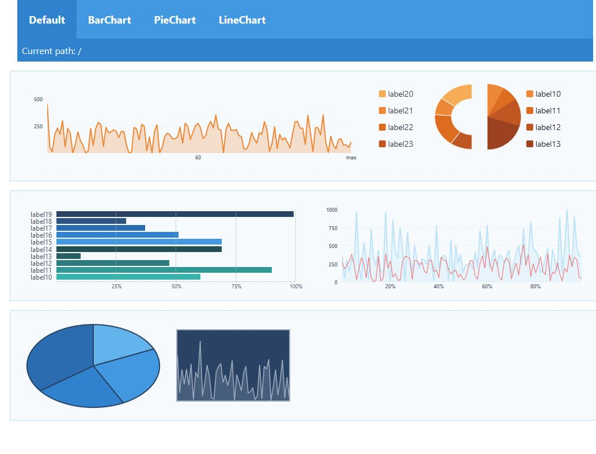

# pancake-graphs
Simple graph library created using [modified](https://github.com/jdomeij/pancake) version of the [pancake](https://github.com/Rich-Harris/pancake) library 

Included:
 * Linechart
   * Optional axis
   * multiple datasets
 * Barchart
 * Pie Chart
   * Optional legend
   * Animated updates
   * Supports donut

